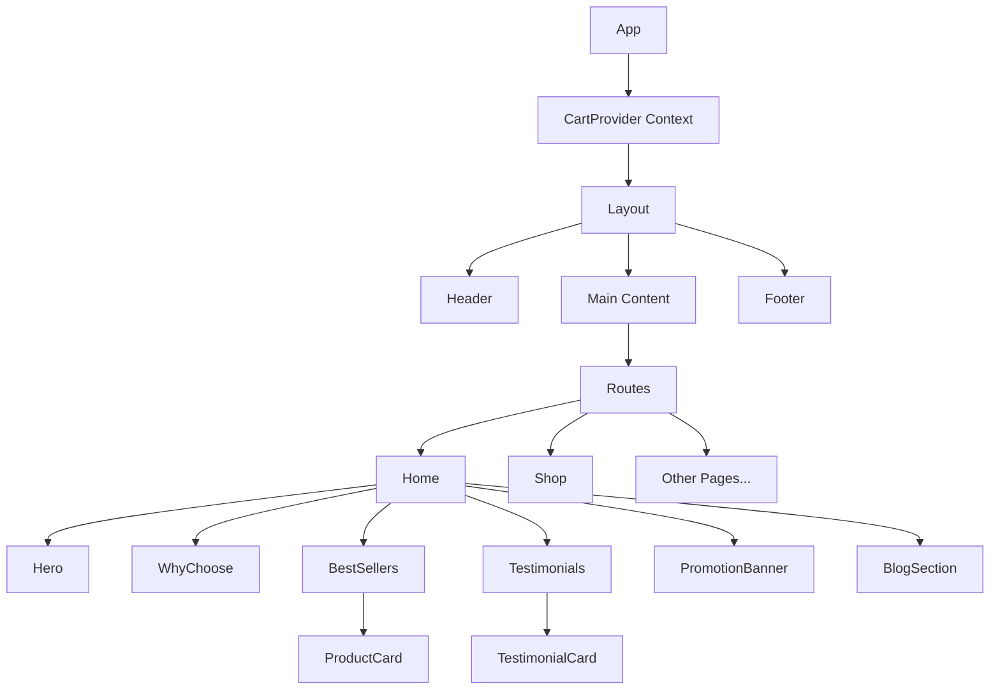
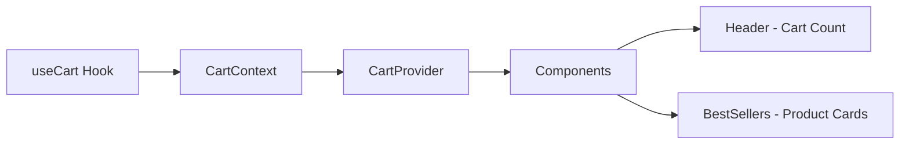
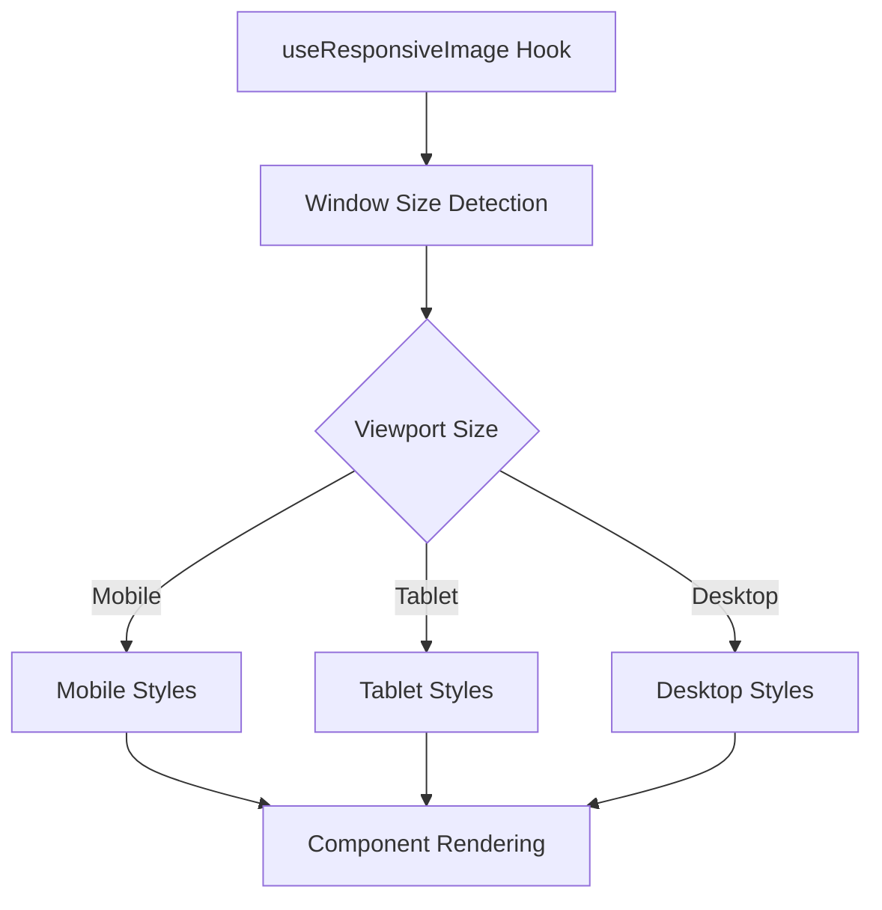

# Xtragleam Skincare - React UI Project

A modern, responsive e-commerce website for Xtragleam Skincare built with React, TypeScript, Vite, and Tailwind CSS. The project features client-side routing, responsive design, and a shopping cart system.

## Table of Contents

- [Project Overview](#project-overview)
- [Architecture](#architecture)
- [Component Structure](#component-structure)
- [Features](#features)
- [Getting Started](#getting-started)
- [Available Scripts](#available-scripts)
- [Tech Stack](#tech-stack)
- [Project Structure](#project-structure)

## Project Overview

Xtragleam Skincare is a modern e-commerce platform that showcases skincare products with a clean, responsive design. The application includes various sections such as hero banner, featured products, testimonials, promotional offers, and blog content.

## Architecture

The project follows a component-based architecture with React and TypeScript. It uses React Router for client-side navigation and Context API for state management.



### State Management



### Responsive Design Flow



## Component Structure

```
src/
├── components/
│   ├── ui/                 # Reusable UI components
│   │   ├── Button.tsx      # Enhanced button with router support
│   │   └── StarRating.tsx  # Star rating component
│   ├── icons/              # SVG icons as React components
│   │   ├── CartIcon.tsx
│   │   ├── HeartIcon.tsx
│   │   └── ...
│   ├── Layout.tsx          # Main layout with header and footer
│   ├── Header.tsx          # Navigation and cart indicator
│   ├── Footer.tsx          # Site footer with links
│   ├── Home.tsx            # Home page component
│   ├── Hero.tsx            # Hero banner section
│   ├── WhyChoose.tsx       # Why choose section
│   ├── BestSellers.tsx     # Featured products section
│   ├── ProductCard.tsx     # Individual product display
│   ├── Testimonials.tsx    # Testimonials section
│   ├── TestimonialCard.tsx # Individual testimonial
│   ├── PromotionBanner.tsx # Promotional countdown banner
│   └── BlogSection.tsx     # Blog content section
├── context/                # React context for state management
│   ├── CartContext.tsx     # Cart provider component
│   ├── CartContextDefinition.ts # Cart context type definitions
│   └── useCartContext.ts   # Custom hook for cart context
├── hooks/                  # Custom React hooks
│   ├── useCart.ts          # Cart management logic
│   └── useResponsiveImage.ts # Responsive image styling hook
├── data/                   # Static data
│   └── content.json        # Site content and configuration
├── types/                  # TypeScript type definitions
│   └── index.ts            # Shared type definitions
├── App.tsx                 # Main application component
└── main.tsx                # Application entry point
```

## Features

- **Responsive Design**: Adapts to various screen sizes (mobile, tablet, desktop)
- **Client-Side Routing**: Uses React Router for navigation without page reloads
- **Shopping Cart**: Add/remove products with quantity controls
- **Dynamic Content**: Content loaded from structured JSON data
- **Countdown Timer**: Dynamic promotion timer with start/end dates
- **SVG Icons as Components**: Customizable SVG icons as React components
- **Responsive Images**: Smart image handling for different viewport sizes

## Getting Started

### Prerequisites

- Node.js (v16 or higher)
- npm or yarn

### Installation

1. Clone the repository:
   ```bash
   git clone <repository-url>
   cd ui-task
   ```

2. Install dependencies:
   ```bash
   npm install
   # or
   yarn
   ```

3. Start the development server:
   ```bash
   npm run dev
   # or
   yarn dev
   ```

4. Open your browser and navigate to:
   ```
   http://localhost:5173
   ```

## Available Scripts

- `npm run dev` - Start the development server
- `npm run build` - Build the production-ready application
- `npm run lint` - Run ESLint to check for code issues
- `npm run preview` - Preview the production build locally

## Tech Stack

- **React 19**: UI library
- **TypeScript**: Type safety
- **Vite**: Build tool and development server
- **React Router**: Client-side routing
- **Tailwind CSS**: Utility-first CSS framework
- **Context API**: State management

## Project Structure

The project follows a feature-based structure where components are organized by their functionality. Reusable UI components are separated into their own directory, and icons are implemented as React components for better customization.

### Key Design Patterns

1. **Component Composition**: Building complex UIs from smaller, reusable components
2. **Custom Hooks**: Extracting reusable logic into custom hooks (useCart, useResponsiveImage)
3. **Context API**: Managing global state with React Context
4. **Responsive Design**: Using Tailwind CSS for responsive layouts
5. **Client-Side Routing**: Using React Router for SPA navigation